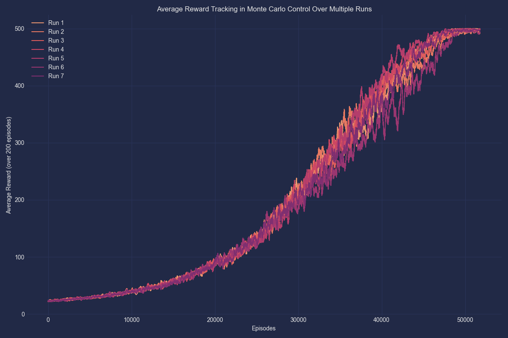
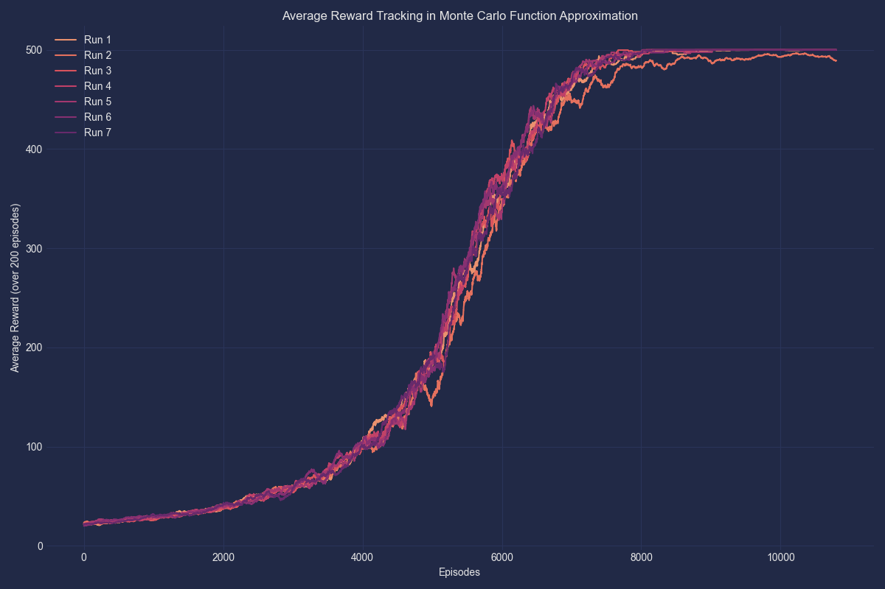
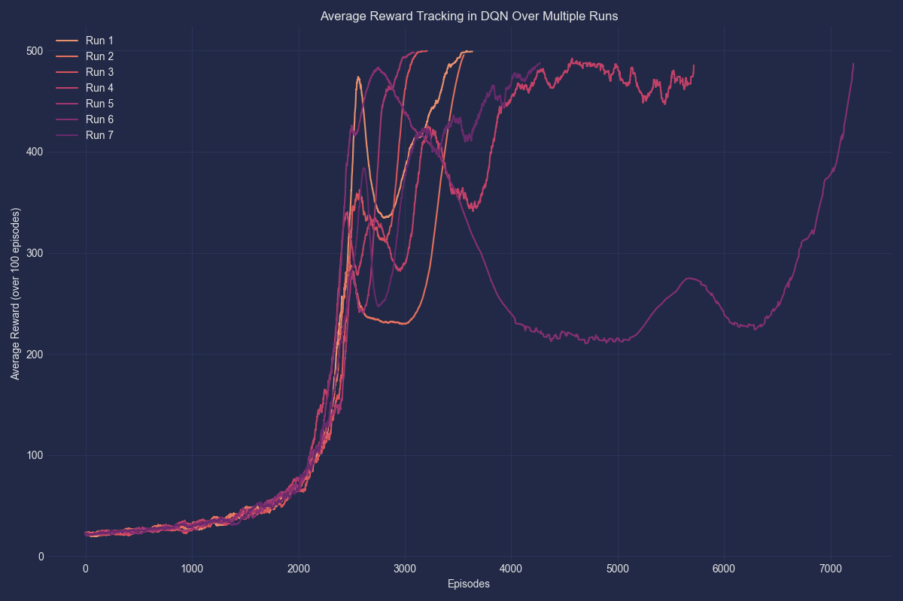
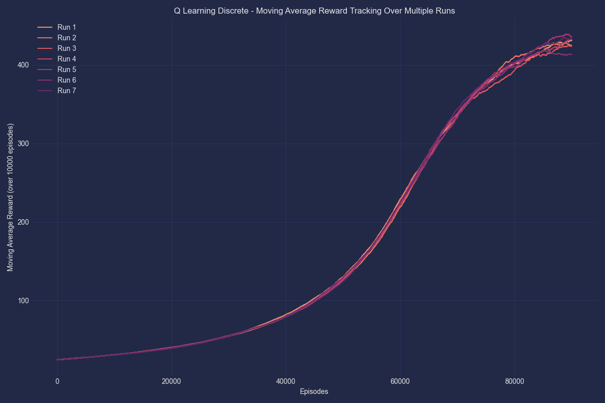
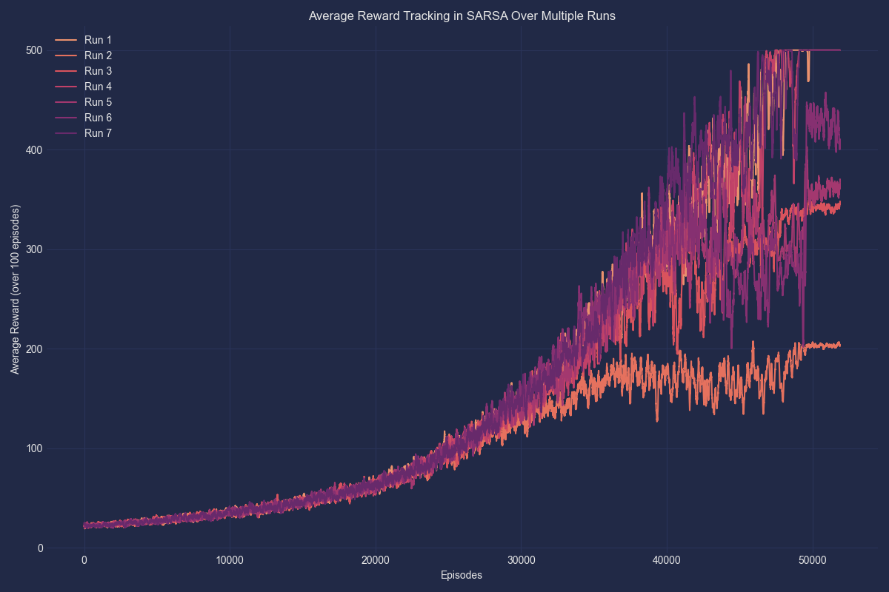
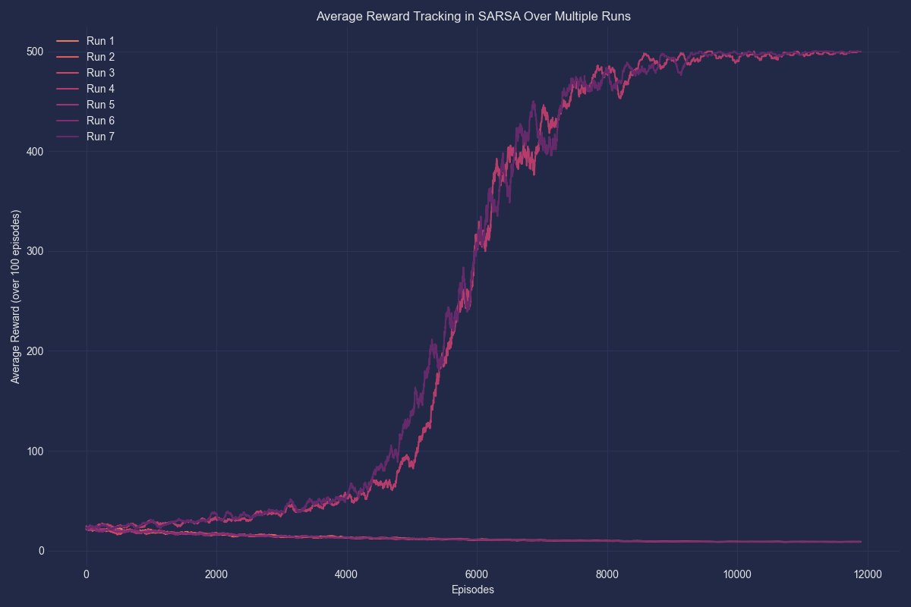
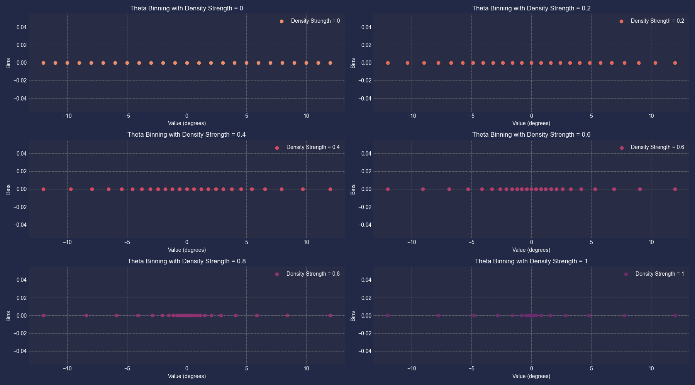

#  Reinforcement Learning Project 1


This repository contains implementations of various reinforcement learning algorithms applied to the gymnasium cartpole-v1 environment. The project explores different approaches to reinforcement learning, including discrete methods, function approximation, and deep learning techniques.

##  Project Structure

The project consists of the following main components:

###  Discrete Methods

- `Monte_Carlo_Discrete.py`: Implementation of the Monte Carlo method for discrete state spaces
- `Q_Learning_Discrete.py`: Implementation of Q-Learning for discrete state spaces
- `SARSA_Discrete.py`: Implementation of SARSA (State-Action-Reward-State-Action) for discrete state spaces

###  Function Approximation Methods

- `Linear_Features_Function_Approximation_SARSA.py`: SARSA with linear function approximation
- `Monte_Carlo_Function_Approximation.py`: Monte Carlo method with function approximation
- `Non_Linear_Function_Approximation_DQN.py`: Deep Q-Network (DQN) implementation

###  Visualization and Analysis

- `VisualizeBinning.py`: Script for visualizing the binning process (for state space discretization)

##  Results

The project includes several visualizations of the results. These images show the performance of the different algorithms, plotting a moving average for seven runs trained in parallel.

<details>
<summary>Click to view result charts</summary>

### Monte Carlo Discrete


### Monte Carlo with Function Approximation


### Non-Linear Function Approximation (DQN)


### Q-Learning Discrete


### SARSA Discrete


### Linear Features Function Approximation SARSA


### Visualize Binning


</details>

##  Getting Started

To run these scripts, you'll need Python installed on your system, along with several libraries commonly used in reinforcement learning projects.

###  Dependencies

- [NumPy](https://numpy.org/): For numerical operations and array manipulations
- [Gymnasium](https://gymnasium.farama.org/): A toolkit for developing and comparing reinforcement learning algorithms
- [Matplotlib](https://matplotlib.org/): For visualizing results through plots and graphs
- [PyTorch](https://pytorch.org/): A popular deep learning framework used for building neural networks
- [Seaborn](https://seaborn.pydata.org/): An extension of Matplotlib for more aesthetically pleasing statistical visualizations
- [MPLCyberpunk](https://github.com/dhaitz/mplcyberpunk): A style sheet for adding a cyberpunk aesthetic to Matplotlib plots
- [Pickle](https://docs.python.org/3/library/pickle.html): For saving and loading serialized Python objects

You can install these dependencies using pip:

```bash
pip install numpy gymnasium matplotlib torch seaborn mplcyberpunk
```

## 🖥 Usage

To run any of the algorithms, use Python to execute the corresponding script. For example:

```bash
python Monte_Carlo_Discrete.py
```

For the `Q_Learning_Discrete.py` file, use the following command with flags:

```bash
python /<PATH_TO_FILE>/Q_Learning_Discrete.py --training --episodes 100000 --density_strength .4 --plot --runs 7
```

For additional information, refer to the comments within each file.

